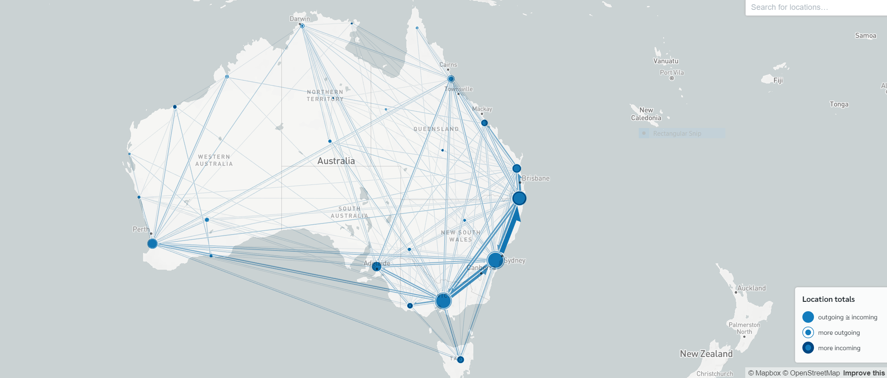

<!-- ------------------------------------------------------------ --> 

```{r setup, include=FALSE}
knitr::opts_chunk$set(echo = FALSE, message = FALSE, warning = FALSE, 
                      fig.width=9, fig.height=7, dpi=300, out.width="900px", out.height="700px")

knitr::opts_knit$set(root.dir = rprojroot::find_rstudio_root_file())

options(scipen=999)
set.seed(12345)

library(pacman) 
p_load(tidyverse, magrittr, readr, readxl, lubridate, 
       scales, janitor, kableExtra, 
       visdat, mvtsplot,  
       sf, tmap, tmaptools)

tmap_mode("view")
```


```{r}
SA3 <- readRDS("Z:/AIRBNB-Q0931/TEMPO_Airbnb/data/geo/SA3_2016_AUST_clean.rds") %>% 
  select(-AREASQKM16, -starts_with("SA4"), -starts_with("GCC"))

SA3_centr <- readRDS("Z:/AIRBNB-Q0931/TEMPO_Airbnb/data/geo/SA3_centr.rds") %>% 
  left_join(select(st_drop_geometry(SA3), SA3_CODE16, SA3_NAME16)) %>% 
  select(SA3_CODE16, SA3_NAME16, lat, lon)

SA2 <- readRDS("Z:/AIRBNB-Q0931/TEMPO_Airbnb/data/geo/SA2_2016_AUST_clean.rds") %>% 
  st_drop_geometry() %>% 
  select(SA2_MAIN16, SA2_NAME16, SA3_CODE16, SA3_NAME16)

SA3_centr %>% 
  st_drop_geometry() %>% 
  write_csv("data/NVS/clean/locations.csv", col_names = FALSE)

SA3_centr_wm <- SA3_centr %>% 
  select(-lat, -lon, -SA3_NAME16) %>%
  st_transform(3857) %>% 
  cbind(., st_coordinates(.)) %>% 
  st_drop_geometry() %>% 
  rename(lon = X, lat = Y)

SA3_centr_wm <- SA3_centr %>% 
  st_drop_geometry() 
```

<!-- ------------------------------------------------------------ --> 

# Origins

Using data from `Home SA2, Month returned from trip and Stopover reason by Nights (000).csv`

Removed observations with region codes like: `Not asked`, `Offshore and Migratory ___`, `Unknown Region ___`, `Transit  ___`,  `Unknown SA2`

`SA3`s from Other Teritories were removed. 

```{r include=FALSE}
origin <- read_csv("data/NVS/raw/Home SA2, Month returned from trip and Stopover reason by Nights (000).zip", skip = 11) %>% 
  clean_names() %>%
  remove_empty(c("rows", "cols")) %>% 
  rename(SA2_NAME16 = home_state_region_sa2,
         month = month_returned_from_trip,
         visitor_nights = x4) %>% 
  mutate(month = factor(month, levels = month.name)) %>% 
  fill(SA2_NAME16, month) %>% 
  filter(SA2_NAME16 != "Total") %>% 
  filter(! SA2_NAME16 %in% c("Not asked")) %>% 
  filter(! grepl('Offshore and Migratory', SA2_NAME16)) %>% 
  filter(! grepl('Unknown Region', SA2_NAME16)) %>% 
  filter(! grepl('Unknown SA2', SA2_NAME16)) %>% 
  filter(! grepl('Transit ', SA2_NAME16)) 

temp <- origin %>% 
  left_join(SA2) %>% 
  filter(is.na(SA3_CODE16)) %>% 
  group_by(SA2_NAME16) %>% 
  summarise(total = sum(visitor_nights, na.rm = TRUE))

origin %<>% 
  left_join(SA2) %>% 
  filter(! is.na(SA3_CODE16)) %>% 
  filter(! SA3_NAME16 %in% c("Christmas Island", "Cocos (Keeling) Islands", 
                             "Jervis Bay", "Norfolk Island")) %>% 
  group_by(SA3_CODE16, SA3_NAME16, stopover_reason, month) %>% 
  summarise(visitor_nights = sum(visitor_nights)) %>% 
  ungroup()
```

There are `r comma(nrow(temp))` locations that do not link to the full list of `SA2_NAME16` codes form ABS. All of them have `nfd` suffix in the name and most have `0` visitors throught the year so most likely these are obsolete codes. These observations have been removed.

```{r}
slice(temp)
```

Median values of guest nights per month per reason:

```{r}
temp <- origin %>% 
  group_by(stopover_reason, month) %>% 
  summarize(median = median(visitor_nights))

temp %>% 
  filter(! stopover_reason %in% c("No other reason", "Not stated/not asked",
                                  "In transit", "Other reason")) %>% 
  ggplot(aes(x = month, y = median, group = stopover_reason, colour = stopover_reason)) + 
  geom_line() +
  theme_light() +
  scale_y_continuous(limits = c(0, 60)) +
  labs(x = "", y = "Median GN", colour = "Stopover reason")
```

<!-- ------------------------------------------------------------ --> 

# Destinations

Using data from `Stopover SA2, Month returned from trip and Stopover reason by Nights (000).csv`

Removed observations with region codes like: `Not asked`, `Offshore and Migratory ___`, `Unknown Region ___`, `Transit  ___`,  `Unknown SA2`

`SA3`s from Other Teritories were removed. 

```{r include=FALSE}
destination <- read_csv("data/NVS/raw/Stopover SA2, Month returned from trip and Stopover reason by Nights (000).zip", skip = 11) %>% 
  clean_names() %>%
  remove_empty(c("rows", "cols")) %>% 
  rename(SA2_NAME16 = stopover_state_region_sa2,
         month = month_returned_from_trip,
         visitor_nights = x4) %>% 
  mutate(month = factor(month, levels = month.name)) %>% 
  fill(SA2_NAME16, month) %>% 
  filter(SA2_NAME16 != "Total") %>% 
  filter(! SA2_NAME16 %in% c("Not asked")) %>% 
  filter(! grepl('Offshore and Migratory', SA2_NAME16)) %>% 
  filter(! grepl('Unknown Region', SA2_NAME16)) %>% 
  filter(! grepl('Unknown SA2', SA2_NAME16)) %>% 
  filter(! grepl('Transit ', SA2_NAME16)) 

temp <- destination %>% 
  left_join(SA2) %>% 
  filter(is.na(SA3_CODE16)) %>% 
  group_by(SA2_NAME16) %>% 
  summarise(total = sum(visitor_nights, na.rm = TRUE))

destination %<>% 
  left_join(SA2) %>% 
  filter(! is.na(SA3_CODE16)) %>% 
  filter(! SA3_NAME16 %in% c("Christmas Island", "Cocos (Keeling) Islands", 
                             "Jervis Bay", "Norfolk Island")) %>% 
  group_by(SA3_CODE16, SA3_NAME16, stopover_reason, month) %>% 
  summarise(visitor_nights = sum(visitor_nights)) %>% 
  ungroup()
```

Again, there are `r comma(nrow(temp))` locations that do not link to the full list of `SA2_NAME16` codes form ABS. All of them have `nfd` suffix in the name and most have `0` visitors throught the year so most likely these are obsolete codes. These observations have been removed.

```{r}
slice(temp)
```

Median values of guest nights per month per reason:

```{r}
temp <- destination %>% 
  group_by(stopover_reason, month) %>% 
  summarize(median = median(visitor_nights))

temp %>% 
  filter(! stopover_reason %in% c("No other reason", "Not stated/not asked",
                                  "In transit", "Other reason")) %>% 
  ggplot(aes(x = month, y = median, group = stopover_reason, colour = stopover_reason)) + 
  geom_line() +
  scale_y_continuous(limits = c(0, 60)) +
  theme_light() +
  labs(x = "", y = "Median GN", colour = "Stopover reason")

```

```{r eval=FALSE, include=FALSE}
destination %>% 
  filter(stopover_reason %in% c("Holiday")) %>% 
  ggplot(aes(x = month, y = visitor_nights, group = SA3_CODE16)) + 
  geom_line(alpha = 0.5) +
  theme_light() +
  labs(x = "", y = "Median GN", colour = "Stopover reason")
```

```{r eval=FALSE, include=FALSE}
temp <- destination %>% 
  filter(stopover_reason %in% c("Holiday")) %>%
  select(SA3_NAME16, month, visitor_nights) %>% 
  spread(SA3_NAME16, visitor_nights)

mvtsplot(temp, norm = "global")
```

<!-- ------------------------------------------------------------ --> 

# OD relationship

## Reason: holidays

```{r}
max <- max(max(origin$visitor_nights), max(destination$visitor_nights))

rename(origin, origin = visitor_nights) %>% 
  left_join(rename(destination, destination = visitor_nights)) %>% 
  filter(stopover_reason == "Holiday") %>% 
  ggplot(aes(x = origin, y = destination)) +
  geom_line(aes(x = destination, y = destination), colour = "darkorchid4", size = 1) +
  geom_point() +
  theme_light() +
  facet_wrap(vars(month)) +
  coord_fixed(xlim = c(0, max), ylim = c(0, max)) +
  labs(x = "GN origin", y = "GN destination", colour = "Stopover reason")
```

## Reason: business

```{r}
max <- max(max(origin$visitor_nights), max(destination$visitor_nights))

rename(origin, origin =  visitor_nights) %>% 
  left_join(rename(destination, destination =  visitor_nights)) %>% 
  filter(stopover_reason == "Business") %>% 
  ggplot(aes(x = origin, y = destination)) +
  geom_line(aes(x = destination, y = destination), colour = "darkorchid4", size = 1) +
  geom_point() +
  theme_light() +
  facet_wrap(vars(month)) +
  coord_fixed(xlim = c(0, max), ylim = c(0, max)) +
  labs(x = "GN origin", y = "GN destination", colour = "Stopover reason")
```

<!-- ------------------------------------------------------------ --> 

# Flows

SA3 level OD matrices constructed from SA2 data. Ignoring reason for travel.

## Directional 

### January 

```{r include=FALSE}
OD_01 <- read_csv("data/NVS/raw/OD_SA2_all_2018-01.zip", skip = 11) %>% 
  remove_empty(c("rows", "cols")) %>% 
  rename(SA2_ORIG = `Stopover state/region/SA2`) %>% 
  filter(SA2_ORIG != "Home State/Region/SA2") %>% 
  filter(SA2_ORIG != "(c) Copyright Space-Time Research 2013") %>% 
  gather(`Baulkham Hills (East)`:Total, key = SA2_DEST, value = visitor_nights) %>% 
  filter(! SA2_ORIG %in% c("Not asked", "Total")) %>% 
  filter(! grepl('Offshore and Migratory', SA2_ORIG)) %>% 
  filter(! grepl('Unknown Region', SA2_ORIG)) %>% 
  filter(! grepl('Unknown SA2', SA2_ORIG)) %>% 
  filter(! grepl('Transit ', SA2_ORIG)) %>% 
  filter(! SA2_DEST %in% c("Not asked", "Total")) %>% 
  filter(! grepl('Offshore and Migratory', SA2_DEST)) %>% 
  filter(! grepl('Unknown Region', SA2_DEST)) %>% 
  filter(! grepl('Unknown SA2', SA2_DEST)) %>% 
  filter(! grepl('Transit ', SA2_DEST)) 

stopifnot(length(unique(OD_01$SA2_ORIG)) ==length(unique(OD_01$SA2_DEST)))

# temp <- OD_01 %>% 
#   left_join(SA2, by = c("SA2_ORIG" = "SA2_NAME16")) %>% 
#   filter(is.na(SA3_CODE16)) %>% 
#   group_by(SA2_ORIG) %>% 
#   summarise(total = sum(visitor_nights, na.rm = TRUE))

OD_01 %<>% 
  left_join(SA2, by = c("SA2_ORIG" = "SA2_NAME16")) %>% 
  filter(! is.na(SA3_CODE16)) %>% 
  rename(SA3_CODE16_ORIG = SA3_CODE16,
         SA3_NAME16_ORIG = SA3_NAME16) %>% 
  select(-SA2_MAIN16) %>% 
  left_join(SA2, by = c("SA2_DEST" = "SA2_NAME16")) %>% 
  filter(! is.na(SA3_CODE16)) %>% 
  rename(SA3_CODE16_DEST = SA3_CODE16,
         SA3_NAME16_DEST = SA3_NAME16) %>% 
  select(-SA2_MAIN16, SA2_ORIG, SA2_DEST) %>% 
  group_by(SA3_CODE16_ORIG, SA3_NAME16_ORIG , SA3_CODE16_DEST, SA3_NAME16_DEST) %>% 
  summarise(visitor_nights = sum(visitor_nights)) %>% 
  ungroup() %>% 
  filter(! SA3_NAME16_ORIG %in% c("Christmas Island", "Cocos (Keeling) Islands", 
                                  "Jervis Bay", "Norfolk Island")) %>% 
  filter(! SA3_NAME16_DEST %in% c("Christmas Island", "Cocos (Keeling) Islands", 
                                  "Jervis Bay", "Norfolk Island")
  ) %>% 
  mutate(date = ymd("2018-01-01"))

stopifnot(nrow(OD_01 %>% filter(SA3_CODE16_ORIG == SA3_CODE16_DEST)) == nrow(SA3))

OD_01 %>% 
  select(SA3_CODE16_ORIG, SA3_CODE16_DEST, visitor_nights) %>% 
  filter(SA3_CODE16_ORIG != SA3_CODE16_DEST) %>% 
  filter(visitor_nights > 0) %>% 
  write_csv("data/NVS/clean/flows_jan.csv", col_names = FALSE)

```



[Interactive version](https://flowmap.blue/1Gs9LT-BCSwgDFbEYcuMx4TCczkdu4chaigaD5NHPrhE)

### August 

```{r include=FALSE}
OD_08 <- read_csv("data/NVS/raw/OD_SA2_all_2018-08.zip", skip = 11) %>% 
  remove_empty(c("rows", "cols")) %>% 
  rename(SA2_ORIG = `Stopover state/region/SA2`) %>% 
  filter(SA2_ORIG != "Home State/Region/SA2") %>% 
  filter(SA2_ORIG != "(c) Copyright Space-Time Research 2013") %>% 
  gather(`Baulkham Hills (East)`:Total, key = SA2_DEST, value = visitor_nights) %>% 
  filter(! SA2_ORIG %in% c("Not asked", "Total")) %>% 
  filter(! grepl('Offshore and Migratory', SA2_ORIG)) %>% 
  filter(! grepl('Unknown Region', SA2_ORIG)) %>% 
  filter(! grepl('Unknown SA2', SA2_ORIG)) %>% 
  filter(! grepl('Transit ', SA2_ORIG)) %>% 
  filter(! SA2_DEST %in% c("Not asked", "Total")) %>% 
  filter(! grepl('Offshore and Migratory', SA2_DEST)) %>% 
  filter(! grepl('Unknown Region', SA2_DEST)) %>% 
  filter(! grepl('Unknown SA2', SA2_DEST)) %>% 
  filter(! grepl('Transit ', SA2_DEST)) 

stopifnot(length(unique(OD_08$SA2_ORIG)) ==length(unique(OD_08$SA2_DEST)))

# temp <- OD_08 %>% 
#   left_join(SA2, by = c("SA2_ORIG" = "SA2_NAME16")) %>% 
#   filter(is.na(SA3_CODE16)) %>% 
#   group_by(SA2_ORIG) %>% 
#   summarise(total = sum(visitor_nights, na.rm = TRUE))

OD_08 %<>% 
  left_join(SA2, by = c("SA2_ORIG" = "SA2_NAME16")) %>% 
  filter(! is.na(SA3_CODE16)) %>% 
  rename(SA3_CODE16_ORIG = SA3_CODE16,
         SA3_NAME16_ORIG = SA3_NAME16) %>% 
  select(-SA2_MAIN16) %>% 
  left_join(SA2, by = c("SA2_DEST" = "SA2_NAME16")) %>% 
  filter(! is.na(SA3_CODE16)) %>% 
  rename(SA3_CODE16_DEST = SA3_CODE16,
         SA3_NAME16_DEST = SA3_NAME16) %>% 
  select(-SA2_MAIN16, SA2_ORIG, SA2_DEST) %>% 
  group_by(SA3_CODE16_ORIG, SA3_NAME16_ORIG , SA3_CODE16_DEST, SA3_NAME16_DEST) %>% 
  summarise(visitor_nights = sum(visitor_nights)) %>% 
  ungroup() %>% 
  filter(! SA3_NAME16_ORIG %in% c("Christmas Island", "Cocos (Keeling) Islands", 
                                  "Jervis Bay", "Norfolk Island")) %>% 
  filter(! SA3_NAME16_DEST %in% c("Christmas Island", "Cocos (Keeling) Islands", 
                                  "Jervis Bay", "Norfolk Island")
  ) %>% 
  mutate(date = ymd("2018-08-01"))

stopifnot(nrow(OD_08 %>% filter(SA3_CODE16_ORIG == SA3_CODE16_DEST)) == nrow(SA3))

OD_08 %>% 
  select(SA3_CODE16_ORIG, SA3_CODE16_DEST, visitor_nights) %>% 
  filter(SA3_CODE16_ORIG != SA3_CODE16_DEST) %>% 
  filter(visitor_nights > 0) %>% 
  write_csv("data/NVS/clean/flows_aug.csv", col_names = FALSE)

```


[Interactive version](https://flowmap.blue/1Zltkg5IfjJflkpzZhgWgPGTGIAk8OdSXE7b0i09KYyM)

## Ignoring direction

```{r}
p_load(mapdeck)
key <- readr::read_file("mapbox.txt")
set_token(key)
```

### mapdeck 

```{r include=FALSE}
OD_01_bd <- 
  OD_01 %>% 
  select(-date) %>% 
  filter(SA3_CODE16_ORIG != SA3_CODE16_DEST) %>% 
  rowwise() %>% 
  mutate(id = paste(min(SA3_CODE16_ORIG, SA3_CODE16_DEST),
                    max(SA3_CODE16_DEST, SA3_CODE16_ORIG), sep = "-")) %>% 
  group_by(id) %>% 
  mutate(visitor_nights_bd = sum(visitor_nights) / 10) %>% 
  arrange(id, SA3_CODE16_DEST) %>% 
  filter(row_number() == 1) %>% 
  ungroup() %>% 
  select(-visitor_nights, -id) %>% 
  left_join(SA3_centr_wm, by = c("SA3_CODE16_ORIG" = "SA3_CODE16")) %>% 
  rename(start_lon = lon, start_lat = lat) %>% 
  left_join(SA3_centr_wm, by = c("SA3_CODE16_DEST" = "SA3_CODE16")) %>% 
  rename(end_lon = lon, end_lat = lat) %>% 
  mutate(info = paste0("<b>",SA3_NAME16_ORIG, " <-> ", SA3_NAME16_DEST, "</b>")) %>% 
  select(-SA3_NAME16.x, -SA3_NAME16.y) %>% 
  as.data.frame()

```

```{r}
mapdeck(token = key, 
        style = mapdeck_style('dark')) %>%
  add_arc(
    data = OD_01_bd
    , origin = c("start_lon", "start_lat")
    , destination = c("end_lon", "end_lat")
    , stroke_from = "SA3_CODE16_ORIG"
    , stroke_to = "SA3_CODE16_DEST"
    , tooltip = "info"
    , layer_id = "arclayer"
    # , legend = TRUE
    , stroke_width = "visitor_nights_bd"
  )
```

### kepler

```{r}
write_csv(OD_01_bd, "data/NVS/clean/kepler_jan.csv")
```

[Map](kepler.gl.nvs.jan.html)


<!-- ------------------------------------------------------------ --> 

# Net

```{r}
SA3_net <- SA3 %>% 
  left_join(
    rename(origin, origin =  visitor_nights) %>% 
      left_join(
        rename(destination, destination =  visitor_nights)
      ) %>% 
      mutate(net = origin - destination) %>% 
      select(-origin, -destination))

# summary(SA3_net$net)
```

## Jan nets across reason

```{r}
SA3_net %>% 
  filter(month == "January") %>% 
  ggplot() +
  geom_histogram(aes(net)) +
  facet_wrap(~stopover_reason)
```

## Yearly nets 

### Holiday

```{r}
SA3_net %>% 
  filter(stopover_reason == "Business") %>% 
  ggplot() +
  geom_histogram(aes(net)) +
  facet_wrap(~month)
```

### Business

```{r}
SA3_net %>% 
  filter(stopover_reason == "Business") %>% 
  ggplot() +
  geom_histogram(aes(net)) +
  facet_wrap(~month)
```

## Spatial view

### Jan vs. Aug, reason: holidays

```{r}
SA3_net %>% 
  filter(stopover_reason == "Holiday") %>% 
  filter(month %in% c("January", "August")) %>% 
  tm_shape() +
  tm_polygons("net", n = 7, palette = "RdYlBu", id = "SA3_NAME16") +
  tm_facets(by = "month")
```

### Jan vs. May, reason: business

```{r}
SA3_net %>% 
  filter(stopover_reason == "Business") %>% 
  filter(month %in% c("January", "August")) %>% 
  tm_shape() +
  tm_polygons("net", n = 7, palette = "RdYlBu", id = "SA3_NAME16") +
  tm_facets(by = "month")
```